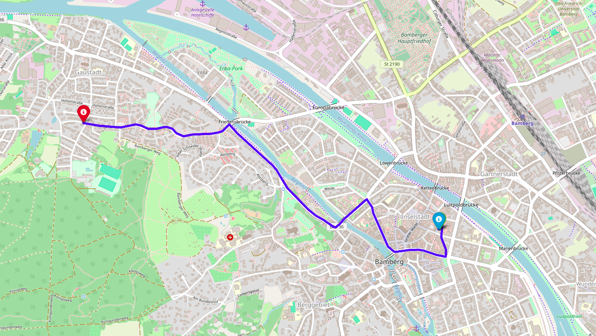

# Route Optimization for Bus Route Profiling

## Overview

Route optimization is a key aspect of transportation systems that aims to determine the most efficient routes for buses, considering factors such as travel time, traffic conditions, distance, and fuel consumption. By leveraging machine learning and transfer learning techniques, we aim to improve route profiling and predict optimal routes that minimize delays and enhance the overall efficiency of public transport systems.

In this project, we focus on optimizing bus routes by:

- Profiling different bus routes to analyze travel patterns.
- Using historical data and real-time inputs for dynamic route suggestions.
- Reducing travel time and operational costs.
- Enhancing the commuter experience by minimizing delays.

Our approach utilizes **transfer learning** to apply knowledge from one route to another, improving predictions without extensive retraining. The result is a flexible and scalable model for bus route optimization.

## Features
- Efficient route prediction using machine learning.
- Dynamic adjustments based on real-time data.
- Integration with traffic signal data for smoother navigation.

## Visualization of Route Optimization

Here is a sample visualization showing how route optimization minimizes travel distance and time:

